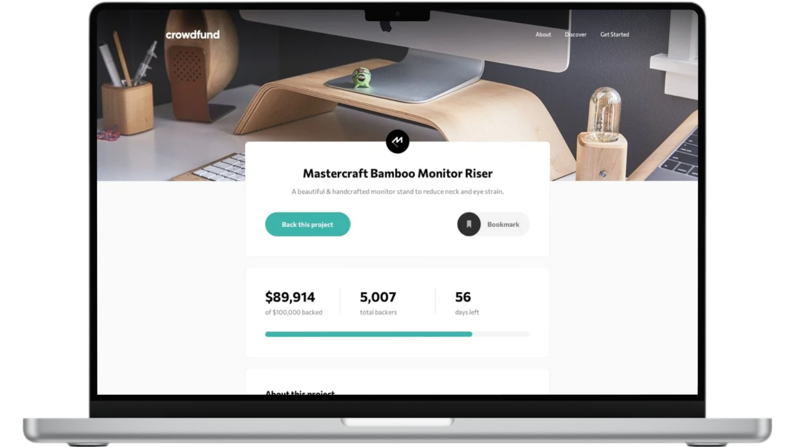

# Crowdfunding

<figure>
    
</figure>

## 📝 **Sobre o Projeto**

Crowdfunding é uma página de produto dinâmica e responsiva, otimizada para todos os dispositivos. Projetada com a abordagem mobile first para navegação fluida em smartphones, tablets e desktops. Oferece uma experiência personalizada, permitindo escolher a quantia de dinheiro a ser doada, além de um menu hambúrguer para facilitar a navegação em dispositivos móveis. O design é moderno e adaptável, com layout responsivo que se ajusta automaticamente ao tamanho da tela.

[Demo do Projeto](https://crowdfunding-walacedev.netlify.app/) 

## 🛠️ **Tecnologias Utilizadas**

- **HTML5** para a estrutura do conteúdo.
- **CSS3** para estilização e design responsivo.
- **JavaScript** para funcionalidades dinâmicas.
- **Sass** (Syntactically Awesome Stylesheets) para pré-processamento de CSS.

## 🚀 **Recursos Principais**
- **Seleção de Opções:** Experiência personalizada para o usuário. O usuário pode escolher a quantia de dinheiro que deseja doar.
- **Menu Hambúrguer:** Melhora a navegação em dispositivos móveis.
- **Mobile First:** Totalmente funcional em todos os dispositivos.
- **Layout Responsivo:** Ajuste automático ao tamanho da tela.

## 📂 **Estrutura do Projeto**

├── src 
│   ├── assets          # Imagens 
│   ├── css             # Arquivo de estilização 
│   ├── js              # Arquivo de JavaScript 
│   └── sass            # Arquivos de pré-processador Sass 
├── .gitattributes      # Configurações de atributos do Git 
├── LICENSE             # Licença MIT 
├── README.md           # Documentação do projeto 
└── index.html          # Arquivo principal HTML do projeto

